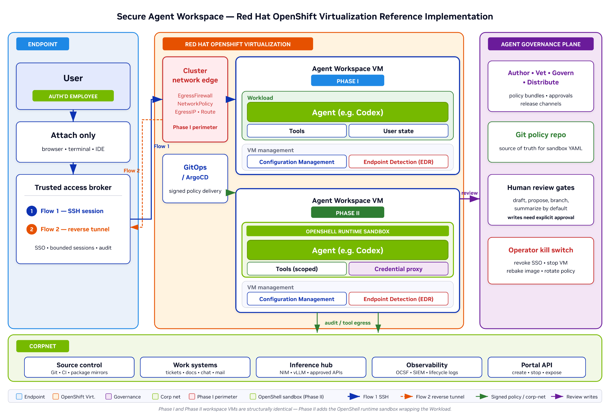
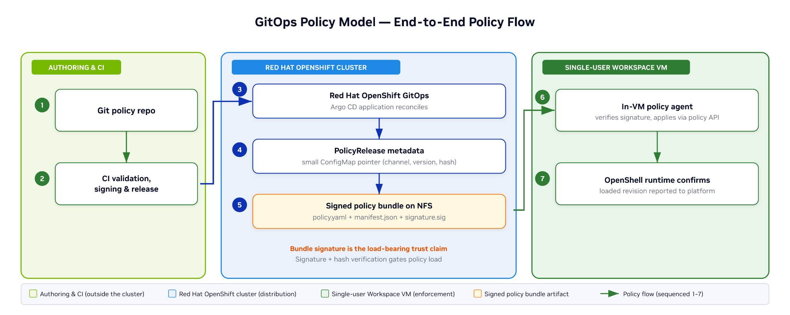
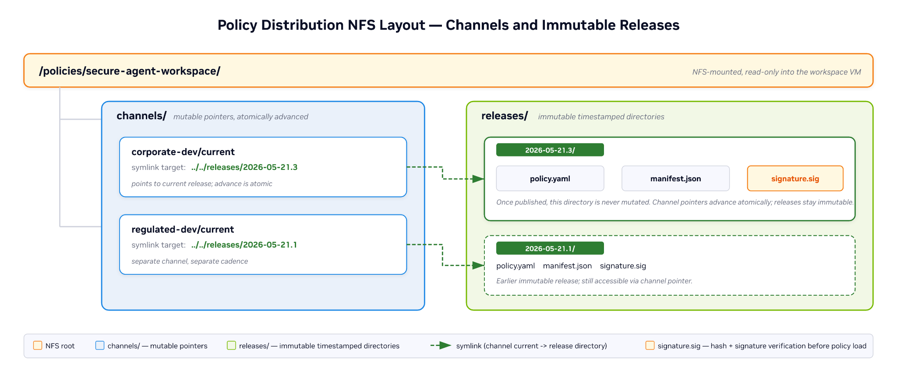

# Secure Agent Workspace

Deploy isolated, per-user AI agent sandboxes on OpenShift Virtualization with OIDC authentication and policy-controlled access.

## Table of Contents

- [Overview](#overview)
- [Detailed description](#detailed-description)
  - [Architecture diagrams](#architecture-diagrams)
- [Requirements](#requirements)
  - [Minimum hardware requirements](#minimum-hardware-requirements)
  - [Minimum software requirements](#minimum-software-requirements)
  - [Required user permissions](#required-user-permissions)
- [Deploy](#deploy)
  - [Prerequisites](#prerequisites)
  - [Installation](#installation)
  - [Validating the deployment](#validating-the-deployment)
  - [Delete](#delete)
- [Repository structure](#repository-structure)
- [References](#references)
- [Technical details](#technical-details)
- [Tags](#tags)

## Overview

Secure Agent Workspace provisions dedicated KubeVirt virtual machines for each user, running NVIDIA OpenShell with NemoClaw/OpenClaw AI agents. Each sandbox is isolated at the VM level, authenticated via OIDC, and connected to the user's chosen inference provider. The platform supports both a GitOps-driven Validated Pattern deployment and a manual quickstart flow.

## Detailed description

Organizations adopting AI coding and knowledge agents need strong isolation guarantees: each user's agent must run in its own boundary, with auditable access to enterprise systems, controlled network egress, and centralized identity management. Traditional container-based isolation is insufficient when agents can execute arbitrary code and tool calls.

This quickstart implements NVIDIA's [Secure Agent Workspace reference architecture](https://docs.nvidia.com/enterprise-reference-architectures/secure-agent-workspace-reference-design/latest/openshift-virtualization-reference-implementation.html) on Red Hat OpenShift. Each user gets a dedicated Fedora 44 VM running the OpenShell gateway and an AI agent (OpenClaw, Hermes, or Deep Agents Code). The VM provides process-level and network-level isolation. OIDC authentication (via Red Hat Build of Keycloak) ensures only the sandbox owner can access their workspace. Secrets for inference providers flow through HashiCorp Vault and the External Secrets Operator, keeping API keys out of Git and helm values.

The system supports multiple inference providers (Gemini, Anthropic, OpenAI, NVIDIA Build, OpenRouter, Ollama, or custom endpoints) and optional web search integration (Tavily, Brave). A bootc-based golden image pipeline pre-bakes all packages into a container image that CDI imports directly, enabling fast VM provisioning without cloud-init package installation.

### Architecture diagrams

The following diagrams are from the [NVIDIA Secure Agent Workspace OpenShift Virtualization Reference Implementation](https://docs.nvidia.com/enterprise-reference-architectures/secure-agent-workspace-reference-design/latest/openshift-virtualization-reference-implementation.html).

#### Reference Architecture



#### GitOps Policy Model



#### Storage Layout



#### Implementation Overview

```
                     OpenShift Cluster
┌──────────────────────────────────────────────────────────┐
│                                                          │
│  Operators (deployed by Validated Pattern or manually):  │
│  ┌──────────────────┐  ┌──────────────────┐             │
│  │ OpenShift         │  │ Red Hat Build    │             │
│  │ Virtualization    │  │ of Keycloak      │             │
│  └──────────────────┘  └──────────────────┘             │
│                                                          │
│  Infrastructure (ArgoCD-managed):                        │
│  ┌──────────┐ ┌──────────┐ ┌──────────────────────────┐ │
│  │ Vault    │ │ ESO      │ │ Keycloak (OIDC provider) │ │
│  └──────────┘ └──────────┘ └──────────────────────────┘ │
│       │                              │                   │
│       │ secrets sync                 │ JWKS validation   │
│       ▼                              ▼                   │
│  ┌──────────────────────────────────────────┐            │
│  │ Golden Image (bootc)                      │            │
│  │ Fedora 44 + OpenShell + podman + nodejs   │            │
│  │ Built via BuildConfig → CDI DataSource    │            │
│  └─────────────────┬────────────────────────┘            │
│                    │ clone per user                       │
│       ┌────────────┼────────────┐                        │
│       ▼            ▼            ▼                        │
│  ┌─────────┐ ┌─────────┐ ┌─────────┐                    │
│  │ alice   │ │ bob     │ │ carol   │  Per-user VMs      │
│  │ sandbox │ │ sandbox │ │ sandbox │  with gateway +    │
│  │  VM     │ │  VM     │ │  VM     │  agent + routes    │
│  └─────────┘ └─────────┘ └─────────┘                    │
│       │            │            │                        │
│       └────────────┼────────────┘                        │
│                    │                                     │
│  Routes:  TLS passthrough (gRPC) + edge (dashboard)     │
└──────────────────────────────────────────────────────────┘
        │
        ▼
   User (openshell CLI / browser)
```

| Component | Technology | Purpose |
|---|---|---|
| VM isolation | OpenShift Virtualization (KubeVirt) | One VM per user with process and network isolation |
| Identity | Red Hat Build of Keycloak (RHBK) | OIDC authentication, user management, SSO |
| Agent runtime | NVIDIA OpenShell + OpenClaw/NemoClaw | AI coding and knowledge agents inside sandbox |
| Gateway | OpenShell Gateway (gRPC over TLS) | Sandbox lifecycle, SSH proxy, inference routing |
| Golden image | Bootc (Fedora 44) + CDI | Pre-baked VM image for fast provisioning |
| Secrets | HashiCorp Vault + External Secrets Operator | API keys for inference providers, SSH keys |
| GitOps | ArgoCD (Validated Patterns) | Declarative cluster configuration |
| Access control | Dashboard token + OIDC gateway validation | Per-user access via application-level tokens |

## Requirements

### Minimum hardware requirements

| Resource | Per sandbox VM | Cluster overhead |
|---|---|---|
| CPU | 4 cores | 8 cores (operators, Keycloak, Vault) |
| Memory | 8 GiB | 16 GiB |
| Storage | 40 GiB (VM disk) | 50 GiB (golden image, registry) |

### Minimum software requirements

| Software | Version |
|---|---|
| Red Hat OpenShift | 4.16+ |
| OpenShift Virtualization operator | stable channel |
| Red Hat Build of Keycloak operator | stable-v24 channel |
| Helm CLI | 3.x |
| oc CLI | matching cluster version |
| openshell CLI | [latest release](https://github.com/NVIDIA/OpenShell/releases) |

### Required user permissions

**Cluster admin** is required for the initial deployment (operator installation, namespace creation). After setup, end users interact only via the `openshell` CLI and their OIDC credentials — no OpenShift access needed.

## Deploy

### Prerequisites

1. An OpenShift 4.16+ cluster with the required operators installed (see Requirements)
2. `oc` CLI logged in with cluster-admin
3. `helm` 3.x installed
4. An API key for at least one inference provider (Gemini, Anthropic, OpenAI, NVIDIA, OpenRouter)
5. The `openshell` CLI installed ([releases](https://github.com/NVIDIA/OpenShell/releases))

Verify prerequisites:

```bash
make check-prereqs
```

### Installation

Two deployment paths are available:

#### Option A: Validated Pattern (automated, GitOps)

Deploys everything — operators, Vault, ESO, Keycloak, secrets, and a default sandbox — via ArgoCD.

```bash
# 1. Clone the repository
git clone https://github.com/validatedpatterns-sandbox/secure-agent-workspace.git
cd secure-agent-workspace

# 2. Generate SSH keys for sandbox provisioning
make generate-keys

# 3. Configure secrets
cp values-secret.yaml.template ~/values-secret.yaml
# Edit ~/values-secret.yaml — set at least one provider API key and SSH keys

# 4. Build images (one-time, ~15 min total)
# These build the sandbox container image and bootc gateway VM image
# inside the cluster via OpenShift BuildConfig. This step will be
# replaced by pre-built upstream golden images in a future release.
make build                    # NemoClaw sandbox image
make build-cli                # NemoClaw CLI image
make build-gateway-image      # Bootc gateway VM image

# 5. Deploy the pattern
make install
```

#### Option B: Quickstart (manual, step-by-step)

Install operators from OperatorHub first, then deploy components manually.

```bash
# 1. Clone the repository
git clone https://github.com/validatedpatterns-sandbox/secure-agent-workspace.git
cd secure-agent-workspace

# 2. Verify prerequisites
make check-prereqs

# 3. Generate SSH keys
make generate-keys

# 4. Build images (one-time, ~10-15 min)
make build                    # NemoClaw sandbox image
make build-cli                # NemoClaw CLI image
make build-gateway-image      # Bootc gateway VM image

# 5. Deploy Keycloak
make keycloak

# 6. Authenticate
make login                    # Opens browser for OIDC login

# 7. Create a sandbox
make openshell-saw-create \
  OPENSHELL_SAW_NAME=my-saw \
  PROVIDER=gemini \
  MODEL=gemini-2.5-flash \
  API_KEY=<your-api-key>

# 8. Configure the openshell CLI
make openshell-saw-configure-gateway OPENSHELL_SAW_NAME=my-saw

# 9. Login to the gateway
openshell gateway login

# 10. Verify
openshell --gateway-insecure sandbox list
```

> **Note:** The gateway VM uses a self-signed TLS certificate. Pass `--gateway-insecure` to `openshell` commands, or set `export OPENSHELL_GATEWAY_INSECURE=true`.

#### Supported inference providers

| Provider | Key | Example model |
|---|---|---|
| Google Gemini | `gemini` | `gemini-2.5-flash` |
| Anthropic | `anthropic` | `claude-sonnet-4-6` |
| OpenAI | `openai` | `gpt-4o` |
| NVIDIA Build | `build` | `meta/llama-3.3-70b-instruct` |
| OpenRouter | `openrouter` | `anthropic/claude-sonnet-4-6` |
| Ollama (local) | `ollama` | `llama3` |
| Custom endpoint | `custom` | any (set `ENDPOINT_URL`) |

### Validating the deployment

```bash
# Check sandbox status
openshell --gateway-insecure sandbox list

# SSH into the sandbox VM
make openshell-saw-ssh OPENSHELL_SAW_NAME=my-saw

# Launch the OpenClaw TUI
make openshell-saw-tui OPENSHELL_SAW_NAME=my-saw

# Open the web UI
make openshell-saw-gui OPENSHELL_SAW_NAME=my-saw

# Run the automated E2E test
make test
```

The `make test` target runs a fully headless E2E test: auto-detects a provider from `~/values-secret.yaml`, deploys Keycloak, fetches an OIDC token via Keycloak's ROPC grant, creates a sandbox, verifies VM health, and cleans up.

### Delete

```bash
# Delete a single sandbox
make openshell-saw-delete OPENSHELL_SAW_NAME=my-saw

# Delete all quickstart resources (Keycloak, images, gateway image)
make delete-all

# Uninstall the validated pattern (experimental)
make uninstall
```

## Repository structure

```
.
├── Makefile                          # Root Makefile (includes common + quickstart)
├── Makefile-common                   # Validated Pattern targets (install, load-secrets, etc.)
├── Makefile-quickstart               # Quickstart targets (build, keycloak, openshell-saw-create, etc.)
├── values-global.yaml                # Pattern config (name, ArgoCD, secret loader)
├── values-prod.yaml                  # ClusterGroup (operators, subscriptions, applications)
├── values-secret.yaml.template       # Secrets template (inference keys, SSH keys)
├── overrides/
│   └── openshell-sandbox.yaml        # Default sandbox values for VP flow
├── charts/                           # ArgoCD-managed Helm charts
│   ├── openshell-keycloak/           # Keycloak CR + KeycloakRealmImport (RHBK operator)
│   ├── openshell-sandbox/            # Per-user sandbox VM + gateway + agent
│   └── pattern-secrets/              # ExternalSecrets for provider API keys + SSH
├── image-builder-charts/             # Build-time charts (imagestreams, bootc image)
│   └── helm/
│       ├── nemoclaw-imagestream/     # NemoClaw sandbox image BuildConfig
│       ├── nemoclaw-cli-imagestream/ # NemoClaw CLI image BuildConfig
│       └── openshell-gateway-image/  # Bootc gateway VM image + golden image
├── scripts/                          # Runtime utilities and automation
│   ├── e2e-test.sh                   # Headless E2E test
│   ├── openshell-saw-create.sh             # Sandbox provisioning logic
│   ├── openshell-saw-gui.sh                # Web UI port-forward
│   ├── openshell-saw-logout.sh             # Clear OIDC tokens from VMs
│   ├── generate-keys.sh              # SSH keypair generation
│   └── oidc-login.sh                 # Browser-based OIDC login
├── tests/                            # Test scripts
│   ├── test-bootc-e2e.sh             # Bootc pipeline E2E (28 checks)
│   ├── test-oidc-templates.sh        # Helm template validation (43 checks)
│   ├── test-access-control.sh        # Per-user access control E2E
│   └── test-multiuser-isolation.sh   # Namespace isolation E2E
├── cli/                              # Admin provisioning CLI (openshell-saw)
├── pattern.sh                        # VP utility container wrapper
└── ansible.cfg                       # VP ansible config
```

## References

- [NVIDIA Secure Agent Workspace Reference Design](https://docs.nvidia.com/enterprise-reference-architectures/secure-agent-workspace-reference-design/latest/)
- [OpenShift Virtualization Reference Implementation](https://docs.nvidia.com/enterprise-reference-architectures/secure-agent-workspace-reference-design/latest/openshift-virtualization-reference-implementation.html)
- [NVIDIA OpenShell](https://github.com/NVIDIA/OpenShell)
- [NVIDIA NemoClaw](https://github.com/NVIDIA/NemoClaw)
- [Red Hat Validated Patterns](https://validatedpatterns.io/)
- [Red Hat Build of Keycloak](https://docs.redhat.com/en/documentation/red_hat_build_of_keycloak/)

## Technical details

### Security model

The system implements layered isolation:

1. **VM-level isolation** — Each user gets a dedicated KubeVirt VM (one VM per user, no shared agent process space)
2. **OIDC authentication** — Keycloak provides SSO with PKCE and device code flow support
3. **Per-user access control** — Auth proxy validates the OIDC token's `preferred_username` matches the sandbox owner
4. **TLS passthrough** — Gateway route preserves gRPC/HTTP2 end-to-end; the gateway validates OIDC tokens directly
5. **Secret management** — API keys flow through Vault + ESO; the user's SSH private key never touches the cluster in plaintext

### Keycloak test users

| Username | Password | Roles |
|---|---|---|
| `developer` | `developer` | `openshell-user` |
| `admin` | `admin` | `openshell-user`, `openshell-admin` |
| `alice` | `alice` | `openshell-user`, `openshell-admin` |
| `bob` | `bob` | `openshell-user`, `openshell-admin` |

### Namespace modes

| Mode | Description |
|---|---|
| `shared` (default) | All sandboxes in one namespace. Scales to thousands of users. |
| `perUser` | Each user gets `saw-<username>` namespace. Kubernetes-level resource isolation. |

### OIDC issuer resolution

The sandbox chart resolves the OIDC issuer URL automatically:
- **Validated Pattern flow:** Computed from `global.clusterDomain` (injected by ArgoCD)
- **Quickstart flow:** Detected from the Keycloak route at `make openshell-saw-create` time
- **Manual override:** Set `oidc.issuerUrl` explicitly

## Tags

| Field | Value |
|---|---|
| **Title** | Secure Agent Workspace |
| **Description** | Deploy isolated, per-user AI agent sandboxes on OpenShift Virtualization |
| **Industry** | Cross-industry |
| **Product** | Red Hat OpenShift |
| **Use case** | AI agent sandboxing, secure coding environments |
| **Partner** | NVIDIA |
