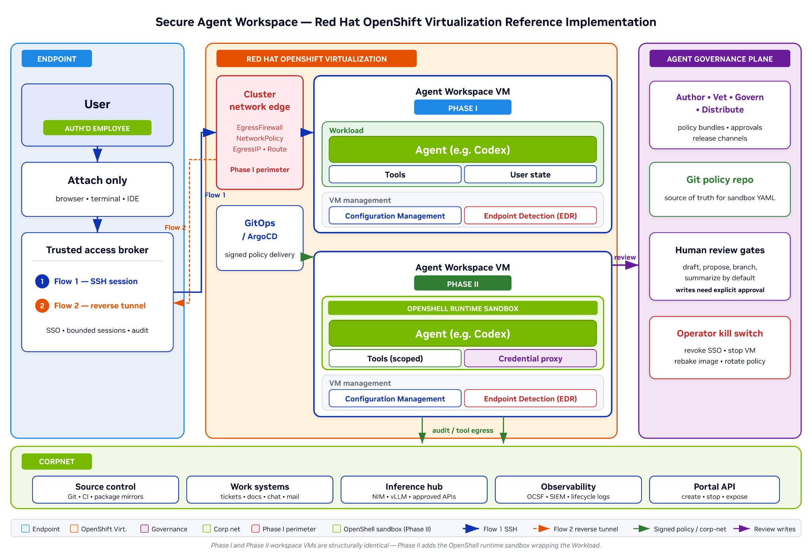
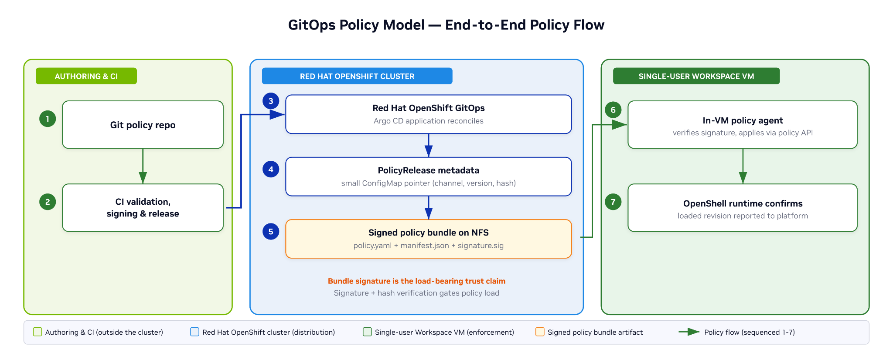
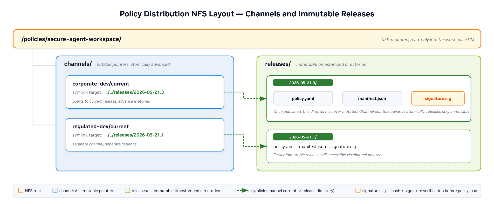

# Secure Agent Workspace

Deploy isolated, per-user AI agent sandboxes on OpenShift Virtualization with OIDC authentication and policy-controlled access.

## Table of Contents

- [Secure Agent Workspace](#secure-agent-workspace)
  - [Table of Contents](#table-of-contents)
  - [Overview](#overview)
  - [Detailed description](#detailed-description)
    - [Architecture diagrams](#architecture-diagrams)
      - [Reference Architecture](#reference-architecture)
      - [GitOps Policy Model](#gitops-policy-model)
      - [Storage Layout](#storage-layout)
      - [Implementation Overview](#implementation-overview)
  - [Requirements](#requirements)
    - [Minimum hardware requirements](#minimum-hardware-requirements)
    - [Minimum software requirements](#minimum-software-requirements)
    - [Required user permissions](#required-user-permissions)
  - [Deploy](#deploy)
    - [Prerequisites](#prerequisites)
    - [Installation](#installation)
      - [Option A: Validated Pattern (automated, GitOps)](#option-a-validated-pattern-automated-gitops)
      - [Option B: Quickstart (manual, step-by-step)](#option-b-quickstart-manual-step-by-step)
      - [Supported inference providers](#supported-inference-providers)
      - [Custom inference provider](#custom-inference-provider)
    - [Validating the deployment](#validating-the-deployment)
    - [Delete](#delete)
  - [Repository structure](#repository-structure)
  - [References](#references)
  - [Technical details](#technical-details)
    - [Security model](#security-model)
    - [Keycloak test users](#keycloak-test-users)
    - [Web UI sign-in (redirect URIs)](#web-ui-sign-in-redirect-uris)
    - [Namespace modes](#namespace-modes)
    - [OIDC issuer resolution](#oidc-issuer-resolution)
  - [Tags](#tags)

## Overview

Secure Agent Workspace provisions dedicated KubeVirt virtual machines for each user, running NVIDIA OpenShell with NemoClaw/OpenClaw AI agents. Each sandbox is isolated at the VM level, authenticated via OIDC, and connected to the user's chosen inference provider. The platform supports both a GitOps-driven Validated Pattern deployment and a manual quickstart flow.

## Detailed description

Organizations adopting AI coding and knowledge agents need strong isolation guarantees: each user's agent must run in its own boundary, with auditable access to enterprise systems, controlled network egress, and centralized identity management. Traditional container-based isolation is insufficient when agents can execute arbitrary code and tool calls.

This quickstart implements NVIDIA's [Secure Agent Workspace reference architecture](https://docs.nvidia.com/enterprise-reference-architectures/secure-agent-workspace-reference-design/latest/openshift-virtualization-reference-implementation.html) on Red Hat OpenShift. Each user gets a dedicated Fedora 44 VM running the OpenShell gateway and an AI agent (OpenClaw, Hermes, or Deep Agents Code). The VM provides process-level and network-level isolation. OIDC authentication (via Red Hat Build of Keycloak) ensures only the sandbox owner can access their workspace. Secrets for inference providers flow through HashiCorp Vault and the External Secrets Operator, keeping API keys out of Git and helm values.

The system supports multiple inference providers (Gemini, Anthropic, OpenAI, NVIDIA Build, OpenRouter, Ollama, or custom endpoints) and optional web search integration (Tavily, Brave). A bootc-based golden image pipeline pre-bakes all packages into a container image that CDI imports directly, enabling fast VM provisioning without cloud-init package installation.

For a self-hosted OpenAI-compatible endpoint (vLLM, Ollama, ...), see [Custom inference provider](#custom-inference-provider).

### Architecture diagrams

The following diagrams are from the [NVIDIA Secure Agent Workspace OpenShift Virtualization Reference Implementation](https://docs.nvidia.com/enterprise-reference-architectures/secure-agent-workspace-reference-design/latest/openshift-virtualization-reference-implementation.html).

#### Reference Architecture



#### GitOps Policy Model



#### Storage Layout



#### Implementation Overview

```
                     OpenShift Cluster
┌──────────────────────────────────────────────────────────┐
│                                                          │
│  Operators (deployed by Validated Pattern or manually):  │
│  ┌──────────────────┐  ┌──────────────────┐              │
│  │ OpenShift        │  │ Red Hat Build    │              │
│  │ Virtualization   │  │ of Keycloak      │              │
│  └──────────────────┘  └──────────────────┘              │
│                                                          │
│  Infrastructure (ArgoCD-managed):                        │
│  ┌──────────┐ ┌──────────┐ ┌──────────────────────────┐  │
│  │ Vault    │ │ ESO      │ │ Keycloak (OIDC provider) │  │
│  └──────────┘ └──────────┘ └──────────────────────────┘  │
│       │                              │                   │
│       │ secrets sync                 │ JWKS validation   │
│       ▼                              ▼                   │
│  ┌──────────────────────────────────────────┐            │
│  │ Golden Image (bootc)                     │            │
│  │ Fedora 44 + OpenShell + podman + nodejs  │            │
│  │ Built via BuildConfig → image registry   │            │
│  └─────────────────┬────────────────────────┘            │
│                    │ CDI import per user                 │
│       ┌────────────┼────────────┐                        │
│       ▼            ▼            ▼                        │
│  ┌─────────┐ ┌─────────┐ ┌─────────┐                     │
│  │ alice   │ │ bob     │ │ carol   │  Per-user VMs       │
│  │ sandbox │ │ sandbox │ │ sandbox │  with gateway +     │
│  │  VM     │ │  VM     │ │  VM     │  agent + routes     │
│  └─────────┘ └─────────┘ └─────────┘                     │
│       │            │            │                        │
│       └────────────┼────────────┘                        │
│                    │                                     │
│  Routes:  TLS passthrough (gRPC) + edge (dashboard)      │
└──────────────────────────────────────────────────────────┘
        │
        ▼
   User (openshell CLI / browser)
```

| Component | Technology | Purpose |
|---|---|---|
| VM isolation | OpenShift Virtualization (KubeVirt) | One VM per user with process and network isolation |
| Identity | Red Hat Build of Keycloak (RHBK) | OIDC authentication, user management, SSO |
| Agent runtime | NVIDIA OpenShell + OpenClaw/NemoClaw | AI coding and knowledge agents inside sandbox |
| Gateway | OpenShell Gateway (gRPC over TLS) | Sandbox lifecycle, SSH proxy, inference routing |
| Golden image | Bootc (Fedora 44) + CDI | Pre-baked VM image for fast provisioning |
| Secrets | HashiCorp Vault + External Secrets Operator | API keys for inference providers, SSH keys |
| GitOps | ArgoCD (Validated Patterns) | Declarative cluster configuration |
| Access control | Dashboard token + OIDC gateway validation | Per-user access via application-level tokens |

## Requirements

### Minimum hardware requirements

| Resource | Per sandbox VM | Cluster overhead |
|---|---|---|
| CPU | 4 cores | 8 cores (operators, Keycloak, Vault) |
| Memory | 8 GiB | 16 GiB |
| Storage | 40 GiB (VM disk) | 50 GiB (golden image, registry) |

### Minimum software requirements

| Software | Version |
|---|---|
| Red Hat OpenShift | 4.22+ |
| OpenShift Virtualization operator | stable channel |
| Red Hat Build of Keycloak operator | stable-v26 channel |
| Helm CLI | 3.x |
| oc CLI | matching cluster version |
| openshell CLI | [a release from the gateway's release series](https://github.com/NVIDIA/OpenShell/releases) (0.1.x for this BOM) |
| jq, curl, openssl | required by `make login` |
| Python 3 and PyYAML | required by local Keycloak user management scripts |
| uv | required for local Python tests (`make test`); uses the root `pyproject.toml` and `uv.lock` |

### Required user permissions

**Cluster admin** is required for the initial deployment (operator installation, namespace creation). After setup, end users interact only via the `openshell` CLI and their OIDC credentials — no OpenShift access needed.

## Deploy

### Prerequisites

1. An OpenShift 4.22+ cluster with the required operators installed (see Requirements)
2. `oc` CLI logged in with cluster-admin
3. `helm` 3.x installed
4. An API key for at least one inference provider (Gemini, Anthropic, OpenAI, NVIDIA, OpenRouter)
5. The `openshell` CLI installed at the API version pinned by the gateway BOM
   (`0.1.2` for the current `0.1.2-rhaiv.0` image;
   [releases](https://github.com/NVIDIA/OpenShell/releases))

Verify prerequisites:

```bash
make prereqs-check
```

### Installation

Two deployment paths are available:

#### Option A: Validated Pattern (automated, GitOps)

Deploys everything — operators, Vault, ESO, Keycloak, secrets, and a default sandbox — via ArgoCD.

```bash
# 1. Clone the repository
git clone https://github.com/validatedpatterns-sandbox/secure-agent-workspace.git
cd secure-agent-workspace

# 2. Log in to OpenShift with cluster-admin
oc login --server=https://api.<cluster>:6443 -u <user>

# 3. Generate SSH keys (used for on-demand SSH into the gateway VM)
make ssh-key-generate

# 4. Configure secrets
# make ssh-key-generate (step 3) already created ~/values-secret.yaml from the
# template; edit it to add your inference and web-search keys. The Validated
# Patterns framework reads ~/values-secret-secure-agent-workspace.yaml before ~/values-secret.yaml,
# so the pattern-named file wins when both exist.
# The default profile needs an NVIDIA key and a Brave Search key:
#   ~/.nvidia-api-key and ~/.brave-api-key (one line each, chmod 600)

# 5. Copy pre-built images to the cluster (~5 min)
# Mirrors images from quay.io/rh-ai-quickstart to the internal registry.
# No build needed — images are pre-built by maintainers.
make images-mirror

# 6. Deploy the pattern (runs inside the VP utility container)
# NOTE: The deploying branch must exist on the remote (origin).
# pattern.sh forwards TARGET_BRANCH and TARGET_ORIGIN (not TARGET_REVISION).
#   export TARGET_BRANCH=main TARGET_ORIGIN=origin
./pattern.sh make install

# 7. Authenticate and configure the CLI
make login                    # Opens the browser for Keycloak sign-in
export OPENSHELL_SAW_NAME=alice          # VM alice in namespace saw-alice
make saw-configure
openshell gateway login $OPENSHELL_SAW_NAME   # Authenticate CLI with gateway

# 8. Verify
# The first command lists the default workspace; the second lists cuda-dev.
openshell sandbox list
openshell sandbox list --workspace cuda-dev
```

Add or remove one `users:` entry in `overrides/saw-users.yaml` and push; Argo CD creates or removes `saw-<name>`.
Each user's virtual machine is named after them, in namespace `saw-<name>` (Alice's machine is `alice` in `saw-alice`, not `openshell-saw`), the same layout as `make saw-create OPENSHELL_SAW_NAME=alice`.
Set `OPENSHELL_SAW_NAME` to the user name; `SAW_NS` defaults to `saw-<name>`.
Removing an entry deletes that user's Argo apps and leaves the VM running.
To delete the namespace and the VM as well, first set `pruneOnRemove: true` on that user's entry and push, then remove the entry and push.
Upgrading an install that still has the `openshell-saw` VM: see [Upgrading from the single-user layout](docs/deployment-guide.md#upgrading-from-the-single-user-layout).

#### Option B: Quickstart (manual, step-by-step)

Install operators from OperatorHub first, then deploy components manually. After the OpenShift Virtualization operator is installed, create a `HyperConverged` resource, or no node can run VMs; External Secrets is only needed for Option A. See [Quickstart notes](docs/deployment-guide.md#quickstart-notes). The images-mirror step mirrors prebuilt images and may fall back to the `latest` tag; see [Golden image tag](docs/deployment-guide.md#golden-image-tag). RHBK must be installed in the `saw-keycloak` namespace (step 3 sets `KEYCLOAK_NS`; point it at another namespace to reuse a Keycloak your cluster already has). Each sandbox gets its own namespace, `saw-<name>`.

```bash
# 1. Clone the repository
git clone https://github.com/validatedpatterns-sandbox/secure-agent-workspace.git
cd secure-agent-workspace

# 2. Log in to OpenShift with cluster-admin
oc login --server=https://api.<cluster>:6443 -u <user>
# Lab clusters with a self-signed API certificate: add --insecure-skip-tls-verify (disposable clusters only)

# 3. Set the variables the following targets read (set them again in every new terminal)
export KEYCLOAK_NS=saw-keycloak     # or the namespace of a Keycloak your cluster already runs
export OPENSHELL_SAW_NAME=alice     # the user VM, deployed into namespace saw-alice

# 4. Verify prerequisites after CNV and RHBK are installed
make quickstart-prereqs-check
# This check is read only. make images-mirror enables the registry route.

# 5. Generate SSH keys
make ssh-key-generate

# 6. Copy pre-built images to the cluster
make images-mirror

# 7. Deploy Keycloak (if one is already running in KEYCLOAK_NS, it is used;
#    you are asked before the OpenShell realm is imported into it;
#    set USE_EXISTING_KEYCLOAK=yes to import the realm without the prompt)
make keycloak-deploy

# 8. Verify Keycloak (realm, openshell-cli client, roles)
make keycloak-check
make keycloak-issuer

# 9. Deploy governance policy and interceptor
make governance-deploy

# 10. Authenticate
make login                    # Opens the browser for Keycloak sign-in
make whoami                   # Verify identity

# 11. Create the user VM (deploys into namespace saw-$OPENSHELL_SAW_NAME)
#     Keys come from files so they stay out of the shell history.
#     The default data-science profile also creates a Brave Search provider,
#     so it needs WEB_SEARCH_API_KEY; without it the in-VM apply fails with
#     "credential for provider 'brave' in workspace 'default' not found".
#     The target asks "Press Enter to set owner to '<you>', ..."; press Enter.
#     To create a VM for someone else, pass OWNER=<name> OWNER_SUBJECT=<keycloak-user-id>.
read -r WEB_SEARCH_API_KEY < "$HOME/.brave-api-key"
read -r API_KEY < "$HOME/.nvidia-api-key"
export WEB_SEARCH_API_KEY API_KEY
make saw-create \
  PROVIDER=build \
  MODEL=nvidia/nemotron-3-super-120b-a12b
unset API_KEY WEB_SEARCH_API_KEY
```

> **OIDC issuer:** `make saw-create` stops if it cannot find Keycloak in `KEYCLOAK_NS`. Set `OIDC_ISSUER` to use a different issuer. Set `OIDC_ISSUER=none` only when you intend to deploy without OIDC. External and no-OIDC modes disable the dashboard and web UI routes because this repository cannot register their redirect URIs.

```bash
# 12. Follow the in-VM installer (in another terminal)
make saw-logs

# 13. Check status
make saw-list
make status

# 14. Wait for the installer to finish
#     saw-status adds your public key to the VM's access Secret,
#     then reaches the VM over SSH to read the installer status.
make saw-status
# Wait for "install" and "apply" to show "phase": "Done"

# 15. Configure the openshell CLI: registers the gateway and signs you in
#     through the browser (log in with a test account).
make saw-configure
#     openshell gateway login $OPENSHELL_SAW_NAME
#     Only needed when a device-code sign-in (OPENSHELL_NO_BROWSER=1) did not
#     finish, or the token expired.

# 16. Verify sandboxes
# sandbox list without --workspace only shows workspace "default"
openshell sandbox list
openshell sandbox list --workspace cuda-dev

# 17. Launch TUI (pick one)
# At OpenShell 0.1.x, cuda-sandbox runs plain OpenClaw (NemoClaw onboarding stops in its preflight checks).
SANDBOX_NAME=cuda-sandbox \
WORKSPACE=cuda-dev \
make nemoclaw-tui # NemoClaw
SANDBOX_NAME=notebook \
make openclaw-tui # OpenClaw

# 18. Launch GUI (pick one): make ...-gui port-forwards to the sandbox UI.
#     make sandbox-ui lists owner-restricted routes for enabled profile UIs.
make sandbox-ui
SANDBOX_NAME=cuda-sandbox \
WORKSPACE=cuda-dev \
GUI_PORT=18789 \
make nemoclaw-gui # NemoClaw
SANDBOX_NAME=notebook \
GUI_PORT=18790 \
make openclaw-gui # OpenClaw
```

> **Token expiry:** The OIDC access token lasts 10 hours. The `openshell-cli` client asks for 24 hours, but Keycloak caps the access token at the realm's SSO Session Max, which defaults to 10 hours because the realm import does not raise it; the refresh token lapses after 30 minutes without use. If the gateway token expires, run `openshell gateway login $OPENSHELL_SAW_NAME` to sign in again. Use `make saw-configure` if the gateway configuration is missing.

> **Shell in a sandbox:** `openshell sandbox connect` attaches to the sandbox's main process, which in SAW sandboxes is `sleep infinity` with no terminal, so it shows nothing. Open a shell with `openshell sandbox exec -n notebook -- sh` (use `--workspace cuda-dev` for `cuda-sandbox`). See [Shell access](docs/deployment-guide.md#shell-access).

> **Agent UI:** `make openclaw-gui` and `make nemoclaw-gui` port-forward to the sandbox UI. `make saw-create` now also gives each enabled profile UI its own owner-restricted Route when it uses local Keycloak. The `<name>-dashboard` Route does not reach the sandbox UI on OpenShell 0.1.x. See [OpenClaw UI and the dashboard Route](docs/deployment-guide.md#openclaw-ui-and-the-dashboard-route). Web search and web fetch do not work in the default `notebook` sandbox; see [Web search in the default sandbox](docs/deployment-guide.md#web-search-in-the-default-sandbox).

You can set `OPENSHELL_SAW_NAME` once via `export` and all `saw-*` targets will use it automatically. The sandbox namespace defaults to `saw-$OPENSHELL_SAW_NAME`; set `SAW_NS` if it differs (the pattern's default sandbox is `alice` in `saw-alice`).

> **Sandbox name limit:** `OPENSHELL_SAW_NAME` must be **19 characters or fewer**. OpenShell rejects longer names with "name exceeds maximum length". The Helm chart and `make saw-create` will both fail fast with a clear error if this limit is exceeded.

### Make target migration

The old names remain as aliases for one release. Each alias prints its
replacement. Use `make help` to see all commands.

| Previous target | Current target |
|---|---|
| `check-prereqs` | `prereqs-check` |
| `generate-keys` | `ssh-key-generate` |
| `build-nemoclaw` | `sandbox-build` |
| `build-nemoclaw-cli` | `cli-build` |
| `build-gateway-podman` | `gateway-build-podman` |
| `build-gateway-docker` | `gateway-build-docker` |
| `build-governance-interceptor` | `governance-interceptor-build` |
| `build-governance-interceptor-local` | `governance-interceptor-build-local` |
| `copy-images` | `images-mirror` |
| `keycloak` | `keycloak-deploy` |
| `delete-keycloak` | `keycloak-delete` |
| `delete-all` | `quickstart-delete` |
| `openshell-saw-create` | `saw-create` |
| `openshell-saw-configure-gateway` | `saw-configure` |
| `openshell-saw-list` | `saw-list` |
| `openshell-saw-logs` | `saw-logs` |
| `openshell-saw-status` | `saw-status` |
| `openshell-saw-vm-ssh` | `saw-vm-ssh` |
| `openshell-saw-restart` | `saw-restart` |
| `openshell-saw-ssh` | `saw-ssh` |
| `openshell-saw-tui` | `saw-tui` |
| `openshell-saw-gui` | `saw-gui` |
| `openshell-saw-delete` | `saw-delete` |
| `governance-list-profiles` | `governance-profile-list` |
| `governance-add-profile` | `governance-profile-add` |
| `governance-remove-profile` | `governance-profile-remove` |
| `governance-create-profile` | `governance-profile-create` |

`make gateway-build` selects Podman by default. Set
`CONTAINER_RUNTIME=docker` for Docker. Other values fail before a build starts.
`make pattern-uninstall` calls the standard `uninstall` target. The old
`ssh-secret` target is gone. The chart creates a public key Secret for each
SAW, and `saw-vm-ssh` updates it when needed.

`saw-create`, `saw-delete`, `saw-status`, `saw-logs`, `saw-configure`, and
user access targets require `OPENSHELL_SAW_NAME`. `saw-list`, `status`, and
`governance-profile-list` work without it. The defaults are `NS=openshell-agents`,
`BUILD_NS=openshell-agents`, `KEYCLOAK_NS=saw-keycloak`, and
`SAW_NS=saw-$OPENSHELL_SAW_NAME`. For a manual build, set `QUAY_REPO` and
`OPENSHELL_VERSION` as needed. For `saw-create`, set `PROVIDER`, `MODEL`, and
`API_KEY` in the environment; `OWNER` and `OWNER_SUBJECT` select another owner.

`OPENSHELL_VERSION=0.0.116` names the prebuilt gateway image tag used by
`images-mirror`. The chart's in-VM BOM pins OpenShell `0.1.2-rhaiv.0` by
digest. These are different components. This cleanup does not change either
runtime version. See [the deployment guide](docs/deployment-guide.md#golden-image-tag).

If a prerequisite fails, inspect the reported CLI or operator and run
`make prereqs-check` again. That check does not change the cluster.
`make images-mirror` enables the registry route and stops on access errors.
`make ssh-key-generate` and `make keycloak-deploy` keep existing keys and
passwords. If a GUI port is in use, choose another `GUI_PORT`; the command
will not stop the other process.

The live acceptance test runs only on a dedicated OpenShift test cluster.
After the tested commit is pushed, set `TEST_CLUSTER_CONTEXT`,
`TEST_SAW_NAME`, `TEST_PATTERN_SAW_NAME`, `TEST_OWNER`, `TEST_OWNER_SUBJECT`,
`TEST_SECOND_TOKEN_DIR`, `PROVIDER`, `MODEL`, `API_KEY`,
`WEB_SEARCH_API_KEY`, `TARGET_BRANCH`, `TARGET_ORIGIN`, and the three
executable request checks described in the deployment guide. Then run
`make test-deployment`. It tests manual setup and
the pattern install, uninstall, and reinstall cycle. It records timestamps,
the commit, the cluster context, and exit codes in a local evidence file.
It requires confirmation for interactive TUI and GUI checks. It runs
inference and access checks and records their status codes. See
[the deployment guide](docs/deployment-guide.md#live-deployment-test).

The existing Python CLI has a smaller command set than Make. See
[CLI migration gaps](docs/cli-migration-gaps.md) before moving an operation.

#### Supported inference providers

| Provider | Key | Example model |
|---|---|---|
| Google Gemini | `gemini` | `gemini-2.5-flash` |
| Anthropic | `anthropic` | `claude-sonnet-4-6` |
| OpenAI | `openai` | `gpt-4o` |
| NVIDIA Build | `build` | `meta/llama-3.3-70b-instruct` |
| OpenRouter | `openrouter` | `anthropic/claude-sonnet-4-6` |
| Ollama (local) | `ollama` | `llama3` |
| Custom OpenAI-compatible endpoint (vLLM, Ollama, ...) | `openai` + `ENDPOINT_URL` | the model the server serves; see [Custom inference provider](#custom-inference-provider) |

#### Custom inference provider

Use a model server of your own (vLLM, Ollama, or any OpenAI-compatible API) instead of a cloud provider. The installer creates an `openai` provider with the endpoint's base URL and onboards OpenClaw against that URL. OpenShell 0.1.x has no inference routing: the agent sends a placeholder key, and the sandbox proxy puts in the real one only for the hosts the provider profile names, so the profile must name your endpoint's host (see [docs/custom-inference.md](docs/custom-inference.md)).

Select the `custom-inference` SAW-BOM profile and give the endpoint's URL, model and key.

**Option A (Validated Pattern)** — in `~/values-secret-secure-agent-workspace.yaml`, use the commented custom example of the `inference` secret (`provider: openai`, `model`, `url`, `api_key`), and select the profile in `charts/saw-bom/values.yaml` (committed to the branch the pattern deploys):

```yaml
profiles:
  - custom-inference
```

**Option B (Quickstart)** — one command:

```bash
make saw-create OPENSHELL_SAW_NAME=alice PROFILES=custom-inference \
  PROVIDER=openai MODEL=<served model> \
  ENDPOINT_URL=http://vllm.<namespace>.svc:8000/v1 \
  API_KEY=<key>          # any non-empty value if the server needs no key
```

Notes:

- The **gateway VM** calls the URL, not your laptop: use a cluster Service or Route host. `localhost` is refused.
- With governance on, the `openai` provider type must be in the governance catalog (`charts/governance-policy/profiles/openai.yaml`, shipped with the chart).
- Self-hosted models can be slow; the profile sets a 300-second inference timeout.

Details: [docs/custom-inference.md](docs/custom-inference.md).

### Self-service workspaces and sandbox web UIs

Users can create their own workspace from Red Hat Developer Hub: they pick a SAW-BOM profile and enter only the keys it needs; the keys go to Vault under `secret/data/hub/saw-<user>`, and an Argo CD ApplicationSet builds the workspace like any `overrides/saw-users.yaml` entry. A sandbox with `ui: {route: true}` in its profile gets its own route to the OpenClaw / NemoClaw web UI, signed in with Keycloak and open to the workspace owner only (its sign-in is registered by the redirect registrar: [Web UI sign-in](#web-ui-sign-in-redirect-uris)). Details: [docs/self-service-portal.md](docs/self-service-portal.md); how it fits together: [docs/rhdh-architecture.md](docs/rhdh-architecture.md); step-by-step test: [docs/rhdh-user-guide.md](docs/rhdh-user-guide.md).

### Agent harness: skills, MCP servers and tools

A sandbox's `harnessRef` in its SAW-BOM profile names a harness bundle: skills, MCP servers (`mcp.json`) and OpenClaw tool plugins (`.mjs`). The installer puts it, unchanged, into a volume the sandbox mounts read-only at `/sandbox/harness`, and points OpenClaw at it. Keys never go in a bundle: a server or plugin that calls a service gets its key through a provider attached to the sandbox. A bundle is either an OCI image built from `harness-bundles/` and published to GHCR by CI (`harnessRef: { image: ghcr.io/<owner>/saw-harness-<bundle>@sha256:… }`), or an inline bundle in the saw-bom chart (`harnessRef: { name: <bundle> }`). Details: [docs/harness-bundles.md](docs/harness-bundles.md).

### Validating the deployment

```bash
# List sandboxes (default workspace, then cuda-dev)
openshell sandbox list
openshell sandbox list --workspace cuda-dev

# NemoClaw sandbox (TUI and GUI) — workspace cuda-dev
SANDBOX_NAME=cuda-sandbox \
WORKSPACE=cuda-dev \
make nemoclaw-tui
SANDBOX_NAME=cuda-sandbox \
WORKSPACE=cuda-dev \
GUI_PORT=18789 \
make nemoclaw-gui

# OpenClaw sandbox (TUI and GUI) — workspace default
SANDBOX_NAME=notebook \
make openclaw-tui
SANDBOX_NAME=notebook \
GUI_PORT=18790 \
make openclaw-gui

# Default NemoClaw entry points
make saw-tui
make saw-gui

# Or access the dashboard directly via the route
oc get route ${OPENSHELL_SAW_NAME}-dashboard -n ${SAW_NS:-saw-$OPENSHELL_SAW_NAME} -o jsonpath='https://{.spec.host}'

# Installer status, and a shell on the gateway VM for debugging
# (adds your SSH key to the VM on demand)
make saw-status
make saw-vm-ssh

# Local tests and all 13 Helm charts (no cluster needed)
make lint
make test

# Run offline template validation (43 checks)
./tests/test-oidc-templates.sh
```

For local Python tests, `uv` creates the ignored `.venv` from the locked
project dependencies. `tests/requirements.txt` remains for the existing CI
workflow, which still uses Python and pip.

### Delete

```bash
# Delete a single sandbox
make saw-delete

# Delete Keycloak + PostgreSQL
make keycloak-delete

# Delete quickstart Keycloak and image releases after deleting each SAW
make quickstart-delete

# Uninstall the validated pattern through the documented wrapper
./pattern.sh make pattern-uninstall
```

## Repository structure

```
.
├── Makefile                          # Root Makefile (includes common + quickstart)
├── Makefile-common                   # Validated Pattern targets (install, load-secrets, etc.)
├── Makefile-quickstart               # Component-action quickstart targets
├── values-global.yaml                # Pattern config (name, ArgoCD, secret loader)
├── values-prod.yaml                  # ClusterGroup (operators, subscriptions, applications)
├── values-secret.yaml.template       # Secrets template (inference keys, SSH keys)
├── overrides/
│   └── saw-users.yaml                # One list entry per user
├── charts/                           # ArgoCD-managed Helm charts
│   ├── openshell-keycloak/           # Keycloak CR + KeycloakRealmImport (RHBK operator)
│   ├── openshell-saw/            # Per-user sandbox VM + gateway + agent
│   ├── pattern-secrets/              # ExternalSecrets for provider API keys + SSH
│   └── saw-users/                    # Turns the user list into namespaces and Argo apps
├── image-builder-charts/             # Build-time charts (imagestreams, bootc image)
│   └── helm/
│       ├── nemoclaw-imagestream/     # NemoClaw sandbox image BuildConfig
│       ├── nemoclaw-cli-imagestream/ # NemoClaw CLI image BuildConfig
│       └── openshell-gateway-image/  # Bootc gateway VM image + golden image
├── scripts/                          # Runtime utilities and automation
│   ├── test-deployment.sh            # Live OpenShift deployment test
│   ├── openshell-saw-create.sh             # Sandbox provisioning logic
│   ├── openshell-saw-gui.sh                # Web UI port-forward
│   ├── openshell-saw-logout.sh             # Clear OIDC tokens from VMs
│   ├── generate-keys.sh              # SSH keypair generation
│   └── oidc-login.sh                 # Browser-based OIDC login
├── tests/                            # Test scripts
│   ├── test-bootc-e2e.sh             # Bootc pipeline E2E (28 checks)
│   └── test-oidc-templates.sh        # Helm template validation (43 checks)
├── cli/                              # Admin provisioning CLI (openshell-saw)
├── pattern.sh                        # VP utility container wrapper
└── ansible.cfg                       # VP ansible config
```

## References

- [NVIDIA Secure Agent Workspace Reference Design](https://docs.nvidia.com/enterprise-reference-architectures/secure-agent-workspace-reference-design/latest/)
- [OpenShift Virtualization Reference Implementation](https://docs.nvidia.com/enterprise-reference-architectures/secure-agent-workspace-reference-design/latest/openshift-virtualization-reference-implementation.html)
- [NVIDIA OpenShell](https://github.com/NVIDIA/OpenShell)
- [NVIDIA NemoClaw](https://github.com/NVIDIA/NemoClaw)
- [Red Hat Validated Patterns](https://validatedpatterns.io/)
- [Red Hat Build of Keycloak](https://docs.redhat.com/en/documentation/red_hat_build_of_keycloak/)

## Technical details

### Security model

The system implements layered isolation:

1. **VM-level isolation** — Each user gets a dedicated KubeVirt VM (one VM per user, no shared agent process space)
2. **OIDC authentication** — Keycloak provides SSO with PKCE and device code flow support
3. **Per-user access control** — Auth proxy validates the OIDC token's `preferred_username` matches the sandbox owner
4. **TLS passthrough** — Gateway route preserves gRPC/HTTP2 end-to-end; the gateway validates OIDC tokens directly
5. **Secret management** — API keys flow through Vault + ESO; the user's SSH private key never touches the cluster in plaintext

### Keycloak test users

| Username | Roles |
|---|---|
| `developer` | `openshell-user` |
| `admin` | `openshell-user`, `openshell-admin` |
| `alice` | `openshell-user`, `openshell-admin` |
| `bob` | `openshell-user`, `openshell-admin` |

There are no default passwords. Each user gets a random one (20+
characters with upper and lower case, digits and symbols), kept in Secret
`openshell-keycloak-user-passwords` in the Keycloak namespace: from Vault in
the Validated Pattern (`keycloak-users` in `values-secret.yaml.template`,
generated by `load-secrets`), or generated by `make keycloak-deploy`.
`make keycloak-passwords` lists the users with stored passwords. It does not
print the values.

To sign in as Alice or Bob on macOS, first find the Secret for that user.
For the Validated Pattern test users, the command names
`openshell-keycloak-user-passwords` in `saw-keycloak`.

```bash
make keycloak-password KC_USER=alice
set -o pipefail
oc get secret openshell-keycloak-user-passwords -n saw-keycloak \
  -o jsonpath='{.data.alice}' | base64 -D | pbcopy
```

Paste the clipboard value into Alice's Keycloak password field. For Bob:

```bash
make keycloak-password KC_USER=bob
set -o pipefail
oc get secret openshell-keycloak-user-passwords -n saw-keycloak \
  -o jsonpath='{.data.bob}' | base64 -D | pbcopy
```

The commands do not print a password in the terminal. Clear the clipboard
after sign-in with `printf '' | pbcopy`.
If `make keycloak-password` names `openshell-keycloak-users` instead, use
that Secret name in the `oc get` command; it holds passwords created or reset
through the quickstart targets. Do not put a password in a command argument
or share it in a test log.

For a separate Bob sign-in, open a private browser window and start the
Keycloak login flow there. A normal window can reuse Alice's session and
open her chat without a login page. Bob must receive HTTP 403 when he opens
Alice's sandbox UI. Use Bob's own workspace URL to test his access.
The default `overrides/saw-users.yaml` creates only Alice's workspace, so
Bob has no workspace URL unless you add one.

Self-registration is off: an admin adds users from `overrides/saw-users.yaml`
(the same list that creates their workspaces). Each name not in the realm
yet gets an account with a generated password; users that exist are left
alone, so running it again is safe. Optional per entry: `email`,
`firstName`, `lastName`, `roles` (default `[openshell-user]`). Another file:
`USERS_FILE=<file>`.

```bash
make keycloak-add-users                      # add missing users
make keycloak-password KC_USER=carol         # show the Secret location
make keycloak-reset-password KC_USER=carol   # reset the stored password
```

Passwords set this way are kept in Secret `openshell-keycloak-users`;
`keycloak-passwords` lists the users. These commands do not print passwords.

The realm requires strong passwords for anything users set themselves
(`keycloak.passwordPolicy`: 14+ characters, upper, lower, digit, special,
not the user name or email, not one of the last 5), and locks an account out
for a growing time after 5 failed sign-ins (`keycloak.bruteForce`). A realm
imported before this kept its old settings and passwords (an import never
changes an existing realm): run `make keycloak-harden`
once to apply them, turn registration off, and set the generated passwords.

### Web UI sign-in (redirect URIs)

Each workspace's web UIs (the VM's OpenShell dashboard, and each sandbox UI
route) sign in through Keycloak's `openshell-dashboard` client, and Keycloak
only sends the browser back to a redirect URI registered on that client. Every
UI has its own host, and Keycloak takes no wildcard in a host name, so each
one is registered.

By default the **redirect registrar** does it: one Deployment in Keycloak's
namespace (`charts/openshell-keycloak`, `redirectRegistrar`) registers each
web UI route's `https://<host>/oauth2/callback` within about 15 seconds of
the route appearing (from `overrides/saw-users.yaml` or the self-service
portal), and removes the entries of workspaces that are gone. It signs in as
its own Keycloak client that may only manage the OpenShell realm's clients;
its init container uses the Keycloak admin Secret once per start to set that
client up, and the registrar itself never sees it.

To keep Keycloak admin access out of the cluster entirely, turn it off
(`redirectRegistrar.enabled: false` in the `openshell-keycloak` values) and
register as an administrator instead, with your own `oc` session. The same
targets work alongside the registrar too:

```bash
make -f Makefile-quickstart keycloak-register KC_USER=carol   # account (if new) + carol's web UIs
make -f Makefile-quickstart keycloak-redirects                # what is registered, what is missing
make -f Makefile-quickstart keycloak-redirects-sync           # all workspaces; drops deleted ones
```

`keycloak-register` creates the Keycloak account if it does not exist yet
(generated password stored in a Secret), then adds
`https://<host>/oauth2/callback` for each of the user's web UI routes,
waiting up to `REDIRECT_WAIT` seconds (default 600) for Argo CD to create
them. Until then, signing in to that workspace's UIs fails with Keycloak's
"Invalid parameter: redirect_uri". `keycloak-redirects-sync` adds whatever is
missing and removes the entries it added for workspaces that are gone;
entries it did not add (registered by hand, other apps) are kept.

The registrar and `keycloak-redirects-sync` apply the same rules.

The web UI routes are the ones labelled `saw.redhat.com/oidc-redirect=true` in
the `saw-*` namespaces. With another OIDC issuer, register their callbacks
there instead; this lists them:

```bash
oc get routes -A -l saw.redhat.com/oidc-redirect=true \
  -o jsonpath='{range .items[*]}https://{.spec.host}/oauth2/callback{"\n"}{end}'
```

The scripts verify Keycloak's certificate; for a router certificate signed by
a private CA, set `KEYCLOAK_CA=<ca-bundle.pem>`. For a Keycloak CR not named
`openshell-keycloak`, set `KEYCLOAK_NAME`.

### Namespaces

| Namespace | Contents |
|---|---|
| `saw-<name>` (one per sandbox) | The gateway VM, its installer inputs and provider Secrets |
| `openshell-agents` | Golden VM image, image builds, governance interceptor |
| `saw-keycloak` | Keycloak (RHBK) |

The gateway VM installs itself from a versioned Bill of Materials on every boot; see [docs/versioned-bom-installer.md](docs/versioned-bom-installer.md).

### OIDC issuer resolution

The sandbox chart resolves the OIDC issuer URL automatically:
- **Validated Pattern flow:** Computed from `global.clusterDomain` (injected by ArgoCD)
- **Quickstart flow:** Detected from the Keycloak route at `make saw-create` time
- **Manual override:** Set `oidc.issuerUrl` explicitly

## Tags

| Field | Value |
|---|---|
| **Title** | Secure Agent Workspace |
| **Description** | Deploy isolated, per-user AI agent sandboxes on OpenShift Virtualization |
| **Industry** | Cross-industry |
| **Product** | Red Hat OpenShift |
| **Use case** | AI agent sandboxing, secure coding environments |
| **Partner** | NVIDIA |
